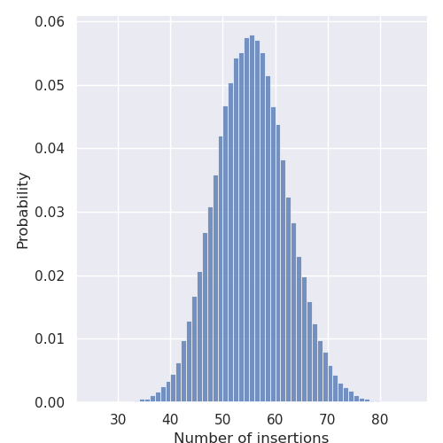

# Top-K implementation for Mempool

## Baseline

There are two baseline implementations: one based on the **max-min-heap** data structure, the other based on the **quickselect** algorithm. They are inspired to two of the most popular algorithms known for the top-k problem, targeting different tradeoffs in terms of time and space complexity. 

### Quickselect
The quickselect is a recursive algorithm based on quicksort: at every iteration, the input vector is split according to a randomly-chosen pivot element. Then, all the elements of the input vector are re-ordered such that the pivot has all the elements with larger values to its left, and those with smaller values to its right. This *partition* is repeated recursively until the pivot element is located in the K-th position of the array. If this happens, it means that the top-K elements of the input vector are be contained in the first K positions of the array. The difference with the quicksort algorithm is that, since there is no need to sort all the elements, the algorithm can be run recursively only on one side of the partition at every iteration, resulting in better runtime performance. The amount of memory required by this algorithm is minimal, since it can work on the input vector without the need of external data structures. On the other hand, the time complexity is non-deterministic, since it depends both on the input data and the choice of the pivot (usually randomized), and can be up to O(N^2) in the worst case. For very large Ns and randomly generated pivots, however, the time complexity tends to O(N).

### Max-Min Heaps
Max(min)-heaps are data structures used to store a partially-ordered set of numbers. In particular, they are particularly helpful for this application, since they guarantee a constant time for retrieving the minimum (maximum, resp.) value of the heap, which will always be situated at the top of the heap. For the sake of this application the heaps are implemented as binary trees, that guarantee worst-case logarithmic insertion time. The algorithm time complexity is therefore O(N*log2(K)). In terms of memory usage, this algorithm requires a local copy (the number of local copies scales with the number of cores) of the heap structure containing the largest (smallest) values found. The memory footprint therefore scales linearly with the hyperparameter K (and with the number of cores). 

### Results
The quicksort algorithm results in worse performance compared to the heap-based algorithm for all the testcases performed (consisting of a coarse-grained grid search over the N and K parameters). The figure below shows a comparison between the two algorithms for a fixed K and increasing input size. The reason is the limited amount of L1 memory available on Mempool, which allows up to ~500KB inputs in the current configuration. Nevertheless, smaller differences are observed for large values of K, since this affects the heap-base algorithm performance more than the quickselect. However, since the expected scenarios for this application are for small values of K (K << N), in none of the representative testcases this was enough to make the quickselect implementation faster. Moreover, the current implementation of the pseudo-random number generator in Mempool is lock-based, resulting in a significative slowdown for parallel implementations. 
")

### Configuration
The code for the execution of the baseline implementations is contained in the *baseline* directory. In order to choose between the heap-based or the quickselect the USE_HEAP macro should be used. Additionally, the DEBUG and BENCH_TOPK macros can be used to print useful debugging information and to enable the tracing of the top-k function, respectively. These macros are defined at the beginning of the *main.c* file, and should be edited manually accorging to the desired configuration.

## Utilities

### Golden Model

A reference C implementation of the Top-K algorithm using heaps can be used in the *utils/reference* directory. The input data can be provided in the same way as for the Mempool code (i.e. C header file containing input vector and defines). The data files can be directly taken from the data generation script, copied to *reference/include* and renamed to *data.h*. The program prints the expected output for the given configuration (N, K, and input data), that can be used to check the output of the Mempool version. One simple way of doing this is to copy-pase the output of the reference implementation in a newly-defined array called *expected_output* in the *data.h* header file of the implementation to test, and finally run the simulation with the DEBUG macro set to 1.

### Data Generation

The performance of the heap-based Top-K algorithm are strongly data-dependent. In particular, for a fixed N and K, the major factor of variability is due to the number of 'insertions' performed by the algorithm. The term 'insertion' here is used to refer to the cases when an element of the input vector is higher than the top-of-the-heap value, requiring the element to be inserted into the heap, resulting in a call to the *heapify* function. In the best case, the largest (smallest) K values of the input array are stored in the first K positions, leading to a number of insertions equal to K. The expected number of insertions depends on the size of the array (N), the number of elements to retrieve (K), as well as the data type and (of course) the input data. According to empirical data gathered during the first phase of the project, the variability of the runtime due to the data-dependence of the algorithm is big enough to lead to results that are difficult to interpret without a large set of comparable results. Due to the long execution time of hardware simulations, it was not feasible to execute enough (only around 5-10 per configuration) simulations to represent this variability in a significative way. Therefore, a data generation program was developed to profile the dependence of the number of insertions (and therefore the runtime) on the input data. The script can be found in the *utils/datagen* directory, and can be used to generate representative input data for each possible hyper-parameter configuration (N, K, data precision, data sign). The term 'representative' used to the describe the generated data refers to the fact that the header files are created using random seeeds that lead to an *average* number of insertions for a specific configuration. The average value has been chosen due to the distribution of the number of insertions: as can be seen in the example figure below, this statistic value is normally distributed.

## Multi-core execution
